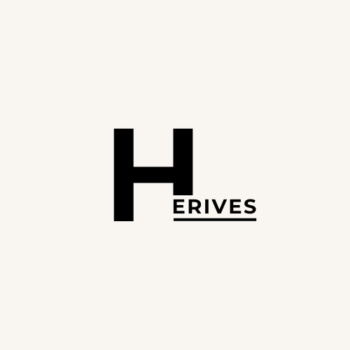

<div id="top"></div>

<!-- PROJECT LOGO -->
<br />
<div align="center">
  <a href="https://herives.portal-lppm.com">
    
  </a>

<h3 align="center">HERIVES</h3>

  <p align="center">
    Identify your rice leaves with HERIVES
    <br />
    <a href="https://herives.portal-lppm.com">View Deployed App</a>
    ·
    <a href="https://github.com/egyyudanugraha/capstone-project-sib3/issues">Report Bug</a>
    ·
    <a href="https://github.com/egyyudanugraha/capstone-project-sib3/issues">Request Feature</a>
  </p>
</div>


<!-- TABLE OF CONTENTS -->
<details>
  <summary>Table of Contents</summary>
  <ol>
    <li>
      <a href="#about-the-project">About The Project</a>
      <ul>
        <li><a href="#built-with">Built With</a></li>
      </ul>
    </li>
    <li>
      <a href="#getting-started">Getting Started</a>
      <ul>
        <li><a href="#prerequisites">Prerequisites</a></li>
        <li><a href="#installation">Installation</a></li>
      </ul>
    </li>
    <li><a href="#roadmap">Roadmap</a></li>
    <li><a href="#contact">Contact</a></li>
    <li><a href="#acknowledgments">Acknowledgments</a></li>
  </ol>
</details>


<!-- ABOUT THE PROJECT -->
## About HERIVES

[](https://herives.portal-lppm.com)
[](https://herives.portal-lppm.com)
[](https://herives.portal-lppm.com)


Healthy Rice Leaves (HERIVES) adalah web app yang dapat digunakan untuk mendeteksi penyakit pada tumbuhan padi hanya dengan sebuah foto. HERIVES dapat digunakan melalui smartphone sehingga dapat dijangkau semua pengguna. Ayo cegah penyakit tanaman padi sejak dini. Padi sehat, petani senang, masyarakat sejahtera!

Project HERIVES dibangun untuk memenuhi tugas akhir atau Capstone Project pada program Studi Independen Bersertifikat - Batch 3.

<p align="right">(<a href="#top">back to top</a>)</p>


### Built With

* [Laravel](https://laravel.com/)
* [Tailwind](https://tailwindcss.com/)
* [Tensorflow Js](https://www.tensorflow.org/js)

#### Dataset & API article
* [Leaf Rice Disease](https://www.kaggle.com/datasets/tedisetiady/leaf-rice-disease-indonesia) 
* [GNews API](https://gnews.io/)

#### Model
[HERIVES Model](https://colab.research.google.com/drive/1ppE-RoglsbiT3o9TPFkcuUueN7PC4mMz?usp=sharing)

<p align="right">(<a href="#top">back to top</a>)</p>


<!-- GETTING STARTED -->
## Getting Started

How to install local herives on your laptop? let's follow the instructions

### Prerequisites
* PHP 8 or higher


### Installation

1. Clone this repository (main branch)
   ```sh
   git clone https://github.com/egyyudanugraha/capstone-project-sib3.git
   ```
2. Install composer
    ```sh
    composer install
    ```
3. Install NPM packages
   ```sh
   npm install
   ```
4. Copy file `.env.example`
   ```sh
   cp .env.example .env 
   ```
5. Generate Key
   ```sh
   php artisan key:generate
   ```
6. Run the server!
   ```sh
   php artisan serve
   ```

7. On another terminal, please run here to build assets
   ```sh
   npm run dev
   ```
   Yeay! Server running on [localhost](http://127.0.0.1:8000)
   
   #### Optional
   To build this project for production, run command
   ```sh
   npm run build
   ```
<p align="right">(<a href="#top">back to top</a>)</p>


<!-- ROADMAP -->
## Roadmap
### Model Machine Learning
- [+] Search dataset
- [+] Make new project on Google Colaboratory
- [+] Download dataset from kaggle to Colab
- [+] Cleaning data
- [+] Make architecture model
- [+] Training model and evaluation
- [+] Deploy model

### Front-End
- [+] Install laravel with tailwind
- [+] Install libarary DaisyUI
- [+] Init Git and make repository on GitHub
- [+] Create landing page
- [+] Create scanning page
- [+] Create article page


<p align="right">(<a href="#top">back to top</a>)</p>

<!-- CONTACT -->
## Contact

- [Egy Yuda](https://www.linkedin.com/in/egyyudanugraha/)
- [Dedy Yehezkiel](https://www.linkedin.com/in/dedy-yehezkiel-147762249/)
- [Yaspin Andika](https://www.linkedin.com/in/yaspin-andika/)
- [Ahdian Mirza](https://www.linkedin.com/in/ahdianmirza/)

<p align="right">(<a href="#top">back to top</a>)</p>


<!-- ACKNOWLEDGMENTS -->
## Acknowledgments
* [Laravel](https://laravel.com/)
* [Tensorflow Js](https://www.tensorflow.org/js)
* [Tailwind](https://tailwindcss.com/)
* [DaisyUI](https://daisyui.com/)
* [MDN Web Docs](https://developer.mozilla.org/)
* [Stack Overflow](https://stackoverflow.com/)
* [Youtube](https://www.youtube.com/)

<p align="right">(<a href="#top">back to top</a>)</p>
